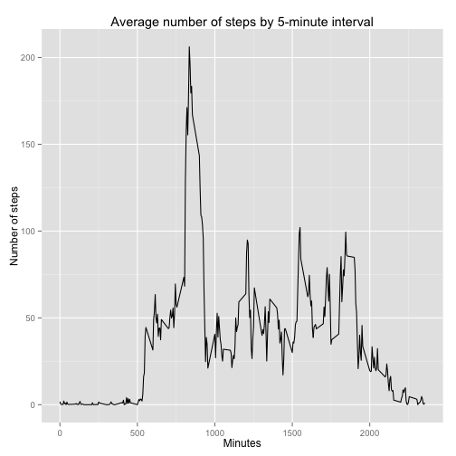
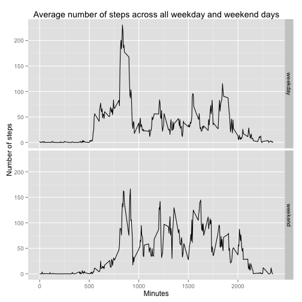

# Reproducible Research: Peer Assessment 1

## Loading and preprocessing the data

```r
library(ggplot2)
activity <- read.csv("activity.csv")
```


## What is mean total number of steps taken per day?

```r
sum_day <- aggregate(activity$steps, list(activity$date), sum)
```

Mean total number of steps taken per day

```r
mean(sum_day[, 2], na.rm = TRUE)
```

```
## [1] 10766
```

Median total number of steps taken per day

```r
median(sum_day[, 2], na.rm = TRUE)
```

```
## [1] 10765
```

### Histogram of the total number of steps taken each day

```r
hist(sum_day[, 2], xlab = "Steps per day", main = paste("Histogram of steps taken each day"))
```

 

## What is the average daily activity pattern?

```r
int_day <- aggregate(activity$steps, list(activity$interval), mean, na.rm = TRUE)
```

Which 5-minute interval, on average across all the days in the dataset, contains the maximum number of steps?

```r
which.max(int_day[, 2])
```

```
## [1] 104
```

Plot of the 5-minute interval (x-axis) and the average number of steps taken, averaged across all days (y-axis)

```r
g <- ggplot(int_day, aes(int_day[, 1], int_day[, 2]))
g + geom_line() + ggtitle("Average number of steps by 5-minute interval") + 
    ylab("Number of steps") + xlab("Minutes")
```

 

## Imputing missing values

Total number of missing values in the dataset

```r
sum(is.na(activity[, 1]))
```

```
## [1] 2304
```

Filling miss vulues by mean for that 5-minute interval from other days

```r
activity2 <- activity
i <- 1
while (i <= nrow(activity2)) {
    if (is.na(activity2[i, 1])) {
        
        activity2[i, 1] <- int_day[int_day[, 1] == activity2[i, 3], 2]
    }
    i <- i + 1
}
```

The mean and median total number of steps taken per day.

```r
sum_day2 <- aggregate(activity2$steps, list(activity2$date), sum)
# Mean
mean(sum_day2[, 2], na.rm = TRUE)
```

```
## [1] 10766
```

```r
# Median
median(sum_day2[, 2], na.rm = TRUE)
```

```
## [1] 10766
```

Q: Do these values differ from the estimates from the first part of the assignment?<br>
A: No<br>
Q: What is the impact of imputing missing data on the estimates of the total daily number of steps?<br>
A: The total daily number of steps will increase<br>

### Histogram of the total number of steps taken each day

```r

hist(sum_day2[, 2], xlab = "Steps per day", main = paste("Histogram of Steps per day after filling miss vulues"))
```

 


## Are there differences in activity patterns between weekdays and weekends?

```r
activity3 <- activity2
j <- 1
while (j <= nrow(activity3)) {
    ## Add day
    activity3[j, 4] <- format(as.Date(activity3[j, 2]), "%w")
    j <- j + 1
}
j <- 1
while (j <= nrow(activity3)) {
    # Add weekday or weekend
    week <- function(x) {
        if (x == 6 | x == 0) {
            return("weekend")
        } else {
            return("weekday")
        }
    }
    activity3[j, 5] <- week(activity3[j, 4])
    j <- j + 1
}
# Create the dataset with two levels – “weekday” and “weekend” indicating
# whether a given date is a weekday or weekend day
int_day_we <- aggregate(activity3$steps, list(activity3$interval, activity3$V5), 
    mean, na.rm = TRUE)
```

### Plot containing a time series plot of the 5-minute interval (x-axis) and the average number of steps taken, averaged across all weekday days or weekend days (y-axis).

```r
g <- ggplot(int_day_we, aes(int_day_we[, 1], int_day_we[, 3]))
g + geom_line() + facet_grid(Group.2 ~ .) + ggtitle("Average number of steps across all weekday and weekend days") + 
    ylab("Number of steps") + xlab("Minutes")
```

 

